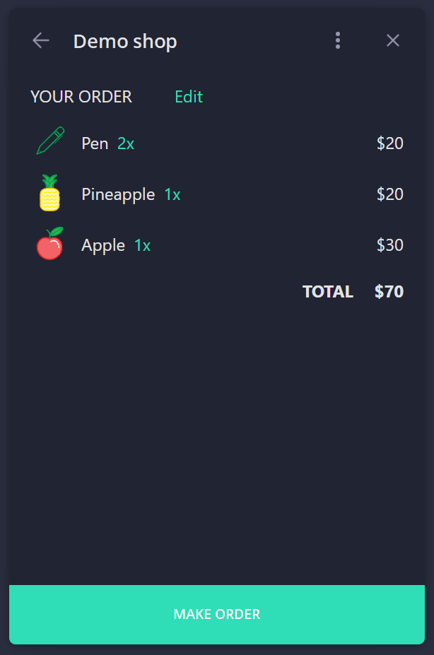

# Demo shop Mini App


Demo shop is a simple [Telegram Mini App](https://core.telegram.org/bots/webapps) providing basic e-commerce functionality. Try this Mini App using [@DemoShopMACBot][2].


Mini Apps can be interpreted as web sites (frontend and backend) running inside Telegram and launched via [bots](https://core.telegram.org/bots). This Mini App consists of three parts:
- backend (*back* folder) - [Go][1] application using [httprouter](https://github.com/julienschmidt/httprouter).
- bot (*bot* folder) - [Go][1] application using [gotgbot](https://github.com/PaulSonOfLars/gotgbot).
- frontend (*miniapp* folder) - [Vue](https://vuejs.org/) application using [Pinia](https://pinia.vuejs.org/), [Vue Router](https://router.vuejs.org/) and [Tailwind CSS](https://tailwindcss.com/).


## Structure


> [How to](https://core.telegram.org/bots#how-do-i-create-a-bot) create a bot and get the bot token.

> [How to](https://core.telegram.org/bots/payments) connect a payment provider and get the payment token.


### backend


Backend is based on **http.Server** - standard HTTP server and **httprouter** - HTTP request router. Server runs on the port 4001, and serves two API endpoints:
- `/goods` - GET-request to get the list of shop items. Data is returned as JSON payload.
- `/order` - POST-request to place the order. Order data is accepted as JSON request body. During the order processing invoice will be created via Bot API, it will be returned as JSON payload.

Backend can be configured with this environment variables:
- `TOKEN` - bot token (add `/test` for test environment).
- `PAY_TOKEN` - pament provider token.

It also supports OPTIONS requests.


### bot


Bot is based on **gotgbot** - Golang Telegram Bot library. Bot supports one command `/start`, to which it replys with the Mini App link (HTTPS URL). It also processes `pre_checkout_query` updates, positively replying to all queries.

Bot can be configured with this environment variables:
- `TOKEN` - bot token.
- `TEST_ENV` - use Telegram test servers.
- `URL` - Mini App HTTPS URL.


There are several ways to launch Mini App. This Mini App uses the next ones:
- When sending `/start` command to [@DemoShopMACBot][2] it replys with inline button **Order goods** which opens the Mini App.
- Also [@DemoShopMACBot][2] has menu button **Order goods** which opens the Mini App. Menu button can be added/configured [using](https://core.telegram.org/bots/webapps#launching-mini-apps-from-the-menu-button) @BotFather.
- Mini App can be opened by direct link (like `https://t.me/DemoShopMACBot/goods`). Direct link are created by linking Mini App to bot using @BotFather command `/newapp`.


### frontend (Mini App)


Demo shop Mini App is a SPA website created with **Vue 3**. It also uses **Pinia** for common state managment, **Vue Router** for routing and **Tailwind CSS** as CSS framework. Mini App consists of these main parts:
- `stores/base.ts` - base store instance, which contains shared state and logic for all pages/components, and interaction with API server (backend).
- `views/GoodsView.vue` - page with the list of shop items.
- `views/OrderView.vue` - page with the list of selected items and total price.
- `components/BackButton.vue`, `components/MainButton.vue` - `WebApp.BackButton` and `WebApp.MainButton` as Vue components.
- `router/index.ts` - routes declaration and router instance.


<p align="center">
  
  
</p>


### Integrated payments algo


- user presses the *Pay* button
- Mini App makes request to the backend, listing selected items
- backend via Bot API (`createInvoiceLink` method) creates invoice link and returns its URL in response
- Mini App opens invoice using `WebApp.openInvoice`
- user fills payment details, phone number and shipping address and proceed with payment
- Telegram sends `pre_checkout_query` update to the bot, to witch it always replys positively
- `WebApp.openInvoice` calls the specified callback


## Setup guide


### Build


To build this project you need to install [Go][1] and [Node.js](https://nodejs.org/en).


Build backend:
```
cd back/
go mod download  // this will install all dependencies
go build
```
> For cross-compilation you can define GOOS and GOARCH environment variables prior to running `go build`.


Build bot:
```
cd bot/
go mod download
go build
```


Build frontend (Mini App) for production:
```
cd miniapp/
npm install  // this will install all dependencies
npm run build  // this will create hostable website in "dist/" folder
```
> You should set `VITE_APP_API` parameter in `.env.production` file, pointing to your backend server. More in Deploy section.


### Deploy


#### Local


To help with local deployement we will be using [ngrok](https://ngrok.com/) as a HTTPS-enabling proxy to our HTTP backend and frontend (Mini App) instances. After installation add these lines to `ngrok.yml`:
```
tunnels:
  back:
    proto: http
    addr: 4001
  miniapp:
    proto: http
    addr: 5173
```
> 4001 is a backend server port. 5173 is a local Node.js server port (you can see actual port after running `npm run dev`).


To start a proxy run `./ngrok start back miniapp`. The output will be something like this:
```
Session Status     online
Account            - (Plan: Free)
Version            3.3.5
Region             Europe (eu)
Latency            -
Web Interface      http://127.0.0.1:4040
Forwarding         https://d842-2a02-2698-28-6a02-bd77-7690-2f56-2e92.ngrok-free.app -> http://localhost:4001
Forwarding         https://7908-2a02-2698-28-6a02-bd77-7690-2f56-2e92.ngrok-free.app -> http://localhost:5173
```

The address `https://d842-2a02-2698-28-6a02-bd77-7690-2f56-2e92.ngrok-free.app` is a HTTPS URL of our backend server, it can be used as `VITE_APP_API` parameter for the frontend (Mini App).

And address `https://7908-2a02-2698-28-6a02-bd77-7690-2f56-2e92.ngrok-free.app` is a frontend (Mini App) HTTPS URL, it can be used as `URL` parameter for the bot.

> For free accounts ngrok shows warning page on first visit. To skip it one can add non-empty `Ngrok-Skip-Browser-Warning` to request headers, it's essential for requests to backend.


Run backend:
```
export TOKEN=""  // bot token
export PAY_TOKEN=""  // payment token
./back/back
```


Run frontend:
```
cd miniapp/
npm run dev  // this will start local Node.js server
```
> You should set `VITE_APP_API` in `.env` file, pointing to your backend server. Use ngrok proxy address for backend.


Run bot:
```
export TOKEN=""  // bot token
export TEST_ENV=""  // any value to use Telegram test servers, empty for production
export URL=""  // ngrok proxy address for miniapp
./bot/bot
```


#### Hosting


> At this point you should have a VPS, domain name pointing to that VPS and SSL certificate issued to that domain name.


> Next instructions applicable for Debian x64 VPS hosting.


Backend and bot should be cross-compiled for Linux x64 (`GOOS="linux"`, `GOARCH="amd64"`). Frontend will be hosted using [nginx](https://nginx.org/).


Upload files:
```
ssh %SRV% "mkdir -p /mac/back/"
scp back/back %SRV%:/mac/back/
ssh %SRV% "chmod +x /mac/back/back"

ssh %SRV% "mkdir -p /mac/bot/"
scp bot/bot %SRV%:/mac/bot/
ssh %SRV% "chmod +x /mac/bot/bot"

ssh %SRV% "mkdir -p /mac/miniapp/"
scp -r miniapp/dist/* %SRV%:/mac/miniapp/
scp -r misc/deploy/miniapp/images/ %SRV%:/mac/miniapp/

scp misc/deploy/nginx/miniapp %SRV%:/etc/nginx/sites-available/
```
> %SRV% - vps address (user@server_ip).


Sample nginx configuration:
```
server {
  listen 443 ssl;
  listen [::]:443 ssl;

  server_name domain.name www.domain.name;

  ssl_certificate domain.name.bundle.cer;
  ssl_certificate_key domain.name.key;
  ssl_protocols TLSv1.2 TLSv1.3;

  location / {
    root /mac/miniapp;
    index index.html;
    try_files $uri $uri/ /index.html;
  }

  location /api/ {
    proxy_pass http://localhost:4001/;
    proxy_set_header Host $host;
    proxy_set_header X-Real-IP $remote_addr;
    proxy_set_header X-Forwarded-For $proxy_add_x_forwarded_for;
    proxy_set_header X-Forwarded-Proto $scheme;
  }
}
```

This configuration describes a HTTPS server with name "domain.name" listening on port 443 and secured with certificate `domain.name.bundle.cer`/`domain.name.key`. All connections to path `/` maps to folder where our Vue application resides. All connections to path `/api/` redirects to our backend server.


Run backend:
```
export TOKEN=""  // bot token
export PAY_TOKEN=""  // payment token
./back/back
```


Run frontend:
```
ln -s /etc/nginx/sites-available/miniapp /etc/nginx/sites-enabled/
systemctl nginx restart
```


Run bot:
```
export TOKEN=""  // bot token
export TEST_ENV=""  // empty for Telegram production servers
export URL=""  // https://domain.name
./bot/bot
```


Open [@DemoShopMACBot][2] and run `/start` command to open Demo shop Mini App.


[1]: https://go.dev/
[2]: https://t.me/DemoShopMACBot
[3]: https://t.me/DemoShopMACBot/goods
